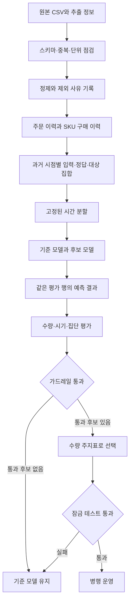

# 파이프라인과 아키텍처

설계 v0. 현재 실행 가능한 것은 **원본 구조 점검**뿐이다. 아래 정제·피처·학습·평가 모듈은 구현 계획이다. 업무 정의는 [결정 문서](decisions.md)를 따른다.

## 시스템 구조

한 프로세스에서 순서대로 실행하는 로컬 배치로 시작한다. 데이터 변환과 모델 학습을 함수/모듈로 분리하고, 같은 변환을 검증과 실제 예측에서 재사용한다.



## 단계별 계약

| 단계 | 입력 | 출력 | 완료 조건 |
|---|---|---|---|
| 0. 원본 점검 | `datase.csv` | `docs/evidence/data-profile.json` | 해시, 스키마, 누락, 반복, 상태 확인. 현재 완료 |
| 1. 업무·데이터 정의 | D01–D04 답변, SQL/마스터 | 데이터 계약 확정본 | 예측 단위, 행 식별, 상태, 추출 완료 시각이 명확 |
| 2. 정제 | 원본과 매핑 | 주문 상세, 주문/상품 이력, 원본↔상세↔집계 연결, 격리 행, 수량 대사표 | 모든 아이템을 추적하고 수량 차이가 조정 내역과 일치 |
| 3. 학습 예제 구성 | 이력, 시점, H, 모집단 규칙 | features, labels, eligible targets, folds | 모든 피처가 예측 시점에 알려진 정보, 라벨 관측 완료 |
| 3a. 관측 연결 | 구조화 이벤트, Grafana 환경 | 수집 경로와 최소 패널 | 첫 baseline/학습 전 실행·실패·완료·null 지표 표시 확인 |
| 4. baseline | 같은 예제와 분할 | 기준 방식별 예측·지표 | 신규/희소 이력에도 정의된 fallback 존재 |
| 5. 지표 동결 | 개발 baseline, 업무 비용 | 평가 버전과 KR 설정 | 주지표, 집단, 임계값, 최소 개선폭을 테스트 전에 고정 |
| 6. 후보 학습 | 학습/검증 예제, 실험 설정 | 모델 묶음, 예측, 학습 로그 | 제한된 탐색 예산, 재현 가능한 설정 |
| 7. 선정·검증 | 공통 예측 테이블 | 순위, 통과 사유, 잠금 테스트 결과 | [평가 계약](evaluation.md) 준수, 실패 시 승격 없음 |
| 8. 운영 연결 | 통과 모델, 새로운 이력 | 배치 예측과 모니터링 | 데이터 최신성·누락·실제 결과 성숙 여부 점검 |

순수요를 정답으로 고르면 취소/반품이 충분히 반영될 때까지 기다리는 기간도 단계 3과 8에 포함한다.

## 예정 코드 구조

아래 트리는 미래 구현 위치다. 존재하지 않는 명령이나 파일을 실행 완료로 취급하지 않는다.

```text
datase.csv                       # 현재 원본, 이동·수정하지 않음
docs/                            # 현재 기록과 설계
scripts/audit_csv.py              # 현재 구현된 읽기 전용 점검
configs/experiment.json          # 예정: 목표, H, 단위, 분할, 지표 버전, seed
src/forecasting/
  ingest.py                      # 로드, 스키마 검증, 원본 행 추적
  clean.py                       # 상태, 상세 식별자, SKU 단위 처리
  events.py                      # 주문·주문일·상품별 이력
  examples.py                    # 과거 시점 입력/라벨/예측 대상
  features.py                    # 학습·예측 공용 피처 변환
  splits.py                      # 시간 분할과 라벨 관측 범위
  baselines.py                   # 반복, 평균 등 기준 예측
  models.py                      # 수량·시기 모델을 묶는 공통 인터페이스
  evaluate.py                    # 지표, 집단, coverage
  select.py                      # 동결된 판정 규칙
  pipeline.py                    # 단계 실행과 결과 기록
tests/                           # 의미 있는 계약·누수 테스트
artifacts/<run_id>/              # 실행별 결과, 기존 실행 덮어쓰지 않음
```

Python을 사용하고, 구조 점검은 표준 라이브러리만 사용한다. 구현 단계에는 pandas/Parquet와 scikit-learn 기반 평가를 검토하며, 첫 학습 모델은 사용자가 선택한 XGBoost다. 버전은 실제 환경에서 설치·검증할 때 고정한다. 현재 패키지 설치나 모델 API 실행 검증은 하지 않았다. Grafana 추적은 사용자 요구로 첫 학습 전에 연결한다. 모델 서버와 분산 작업 관리자는 운영 필요가 확인되면 추가한다.

## 모델·평가 인터페이스

- `fit(train_core, early_stop, config)`에서 예제 피처는 해당 예제 origin까지 알려진 정보로 만든다. train_core와 early_stop 모두 라벨이 fold 학습 기준일 `fit_cutoff`까지 관측·확정되어야 한다. early_stop은 train_core보다 뒤의 별도 구간이다. fit_cutoff 이후 outer backtest와 최종 테스트 정답은 fit에 전달하지 않는다.
- `predict(as_of_features, target_universe)`는 평가 정답에 접근하지 않는다.
- 결과 키는 `run_id, fold_id, origin, customer_id, sku_id, horizon, target_type`이다. 고객 주문 시기처럼 SKU가 없는 목표는 명시적인 별도 `target_type`으로 구분한다.
- 수량과 시기를 함께 내는 **모델 묶음**을 비교한다. 수량 모델만 바꾸고 시기 모델을 baseline으로 고정한 실험은 그렇게 표시한다. 총수량만 내는 모델에서 날짜를 임의로 만들어 평가하지 않는다.
- baseline과 후보는 같은 대상 집합의 모든 키에 예측을 제공한다. 예측 누락 시 공통 fallback을 실행하고 사용 비율을 남긴다.
- 학습에 쓴 데이터 범위·피처 버전·스키마·인코더를 모델과 함께 저장한다.

### 시간 계약 예시

날짜는 일 마감 기준이라는 가정의 예시다. origin=6월 20일, H=7일이면 라벨은 6월 21–27일 수량이다. 확정 지연이 예시로 3일이면 6월 30일까지 기다린 뒤 fit_cutoff=7월 1일 학습에 쓸 수 있다. origin=7월 1일 예제의 7월 2–8일 수량은 같은 7월 1일 학습에 넣을 수 없다. 지연 3일은 실제 확정값이 아니며 원본 이력의 `available_at` 또는 합의된 대기 규칙으로 결정한다.

### 예측 출력 최소 스키마

공통 키 외에 아래 값을 저장한다. 예측 파일과 실제값/관측 상태 파일은 별도로 만든 뒤 평가에서 키로 연결한다.

| 열 | 형식 | 의미 |
|---|---|---|
| predicted_quantity | nullable float | 수량 목표의 예측값. 0과 미예측 null을 구분 |
| predicted_days_to_order | nullable float | origin 이후 다음 주문까지 예측 일수. 시기 목표에 사용 |
| predicted_event_probability | nullable float | 고정 기간 내 주문 여부 모델이 있는 경우에만 [0,1] 확률 |
| prediction_status | enum | ready / forecast_no_event / fallback / error |
| fallback_used, reason | bool, nullable string | 어떤 공통 fallback/예외를 적용했는지 |
| quantity_unit, model_version | string | 수량 단위와 실제 모델 버전 |

고객 단위 시기 목표의 `sku_id`는 null로 저장하며 키 검증은 null을 같은 고객 범위 값으로 정규화해 중복을 검사한다. 기간 합계 수량 0은 정상 수치다. 기간 내 무주문 예측은 발생 여부 정책이 정의된 모델만 `forecast_no_event`로 표시하며, 연속 수량 예측값 0만으로 날짜를 임의 삭제하지 않는다. 실제 다음 주문 미관측은 **실제값 테이블의 censored/unavailable 상태**이며 예측 상태와 구분한다. 시기 모델이 고객 또는 고객×SKU를 대상으로 하는지는 `target_type`으로 고정한다.

## 실행 결과 보존

각 실행은 `manifest.json`, 동결 설정, 데이터 해시, 분할 범위, 코드 버전(Git commit), 환경 버전, 예측 테이블, 전체/집단 지표, fallback 및 제외 건수, 선정 사유를 보존한다.

평가자는 저장된 예측과 실제값으로 지표를 다시 계산할 수 있어야 한다. 보고서의 숫자는 이 결과에서 생성한다. 실험용 고객 코드가 필요한 파일은 로컬 분석 산출물에만 두고, 공유용 문서는 집계 결과를 사용한다.

학습 중간 지표와 상태를 구조화 로그로 남기고 Grafana로 확인한다. 숫자/실행 상태는 Prometheus, 실행별 로그·학습 곡선은 Loki를 사용하는 초안이다. 실행별 최종 예측·지표 파일은 영구 재계산 근거로 보존한다. [패널, 지표 및 수집 계약](observability.md)을 따른다.

## 초기 운영 경계

예측 결과는 우선 기존 업무와 함께 비교한다. 재고 발주량 결정에는 현재고, 입고 예정, 리드타임, 최소 주문량, 결품·과잉 비용이 추가로 필요하다. 지금 CSV로 만드는 고객 주문량 예측을 곧바로 공급업체 발주량으로 해석하지 않는다. 이러한 입력이 없는 단계에서는 재고 최적화 성과를 주장하지 않는다.
