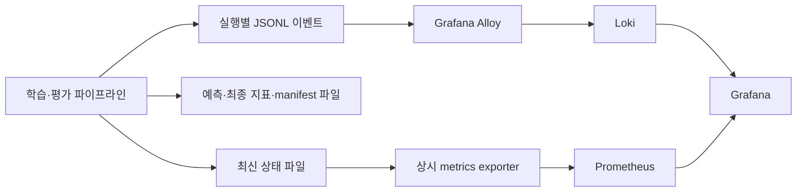

# Grafana 학습·평가 추적

사용자가 Grafana 추적을 요청했다. **현재는 대시보드/수집 설계이며 Grafana 서버, 데이터 소스, 패널을 설치하거나 배포한 상태는 아니다.** 첫 baseline/모델 실행 전에 최소 수집 경로와 패널을 연결한다. 기존 Grafana 사용 가능 여부와 실행 환경은 구현 직전에 확인한다.

## 무엇을 먼저 볼 것인가

1. **미래 구간에서 baseline보다 좋아지는가?** 학습 loss가 낮다는 것만으로 충분하지 않다.
2. **학습만 좋아지고 검증은 나빠지는가?** 과적합의 주요 관찰 신호다.
3. **특정 고객군·상품군이 악화되는가?** 전체 평균이 가리는 실패를 찾는다.
4. **0 또는 낮은 수량을 과도하게 예측하는가?** 희소 구매와 수량 손실함수의 영향을 본다.
5. **정제·집계·대상 선정이 성능을 왜곡하는가?** 아이템 추적, 수량 대사, 제외 비율을 함께 본다.

## 대시보드 1: 실행 현황

| 패널 | 표시 값 | 해석/확인할 상황 |
|---|---|---|
| 실행 상태 | run, 모델, 단계, fold, 시작/종료, 성공/실패/중단 | 완료와 성공을 구분, baseline에도 같은 상태 기록 |
| 진행 | XGBoost boosting round, best iteration, early stopping 상태 | baseline에 학습 iteration을 억지로 표시하지 않음 |
| 시간 | 단계별 소요 시간, 마지막 heartbeat/성공 시각 | 실행 중 heartbeat 단절과 정상 종료를 구분 |
| 자원 | CPU, 프로세스 메모리, 모델 크기, 학습 처리량 | 예상보다 커지면 조인 증식이나 대상 격자 크기 확인. GPU는 사용할 때만 추가 |
| 실행 식별 | 데이터 해시, 평가/피처 버전, H, 단위, 관측 마감 | 서로 다른 목표의 실행을 같은 순위표에 섞지 않음 |

## 대시보드 2: 데이터와 아이템 품질

| 패널 | 표시 값 | 해석/확인할 상황 |
|---|---|---|
| 입력·정제 흐름 | 원본 행, 상세 수, 집계 수, 포함/격리/중복 기여 제외 건수 | 행 감소가 아이템 손실인지 설명 가능해야 함 |
| 상세 추적 coverage | 원본↔상세↔집계 연결률 | 원본 상세 ID 미확보는 100% 해결로 표시하지 않음 |
| 수량 대사 | 상세 기여 수량 합 − 집계 수량 | 확정 단위별로 0이어야 함. 불일치 시 downstream 학습 중단 |
| 입력 이상 | 필수 키 누락, 파싱 실패, 신규 상태, 규격 미확인 | 단순히 행 삭제해서 그래프를 정상으로 만들지 않음 |
| 범주형 입력 | 학습/예측의 고유 범주 수, 미등록 범주 비율, 결측 비율, 사전 버전 | 신규 SKU와 코드 매핑 오류를 구분. 개별 코드 자체를 metric label로 만들지 않음 |
| 모집단 | 신규 고객/SKU, 짧은 이력, 대상 밖 수량, fallback 비율 | 쉬운 고객만 남겨 점수가 좋아졌는지 확인 |
| 정답 관측 | 평가 가능/미관측/상태 미확정 비율 | 최신 기간의 미완료 데이터를 성능 악화로 오인하지 않음 |

현재 데이터 점검의 반복 행 수는 **삭제 대상 수**가 아니다. 상세 ID 없는 임시 추적과 실제 상세 추적을 별도 상태로 표시한다.

## 대시보드 3: 학습과 과적합

| 패널 | 표시 값 | 해석/확인할 상황 |
|---|---|---|
| 학습 곡선 | 같은 정의의 train/validation loss, iteration | train만 내려가고 validation이 상승하면 복잡도/중단 시점 확인 |
| 수량 성능 | 동결 주지표, baseline 값, 차이/개선율 | 학습 loss와 업무 지표의 이름·단위를 명확히 분리 |
| 시간 fold별 성능 | fold별 후보와 baseline 오차 | 특정 기간만 개선되는지 확인 |
| 예측 편향 | 실제/예측 총량, `Σ예측−Σ실제`, 과소/과다량 | 전체 손실 하락과 함께 수량 부족이 커지는지 확인 |
| 희소 수요 | 실제 무구매에서 예측한 수량, 실제 구매에서 놓친 수량 | 전부 0에 가까운 예측의 실패를 드러냄 |
| 피처 진단 | 반복 실험 간 중요도, 핵심 피처 제거 실험 | 중요도는 원인 증명이 아님. ID·금액·최종 상태가 성능을 지배하면 누수 확인 |

피처 중요도는 첫 모델 이후 추가한다. SHAP 등 추가 계산은 진단할 문제가 생기면 도입한다. 학습과 검증의 gap은 참고 신호이며 고정된 임의 숫자 하나로 과적합을 자동 판정하지 않는다.

XGBoost에서는 학습/검증 데이터셋 이름, 목적함수, 관측할 eval metric, best iteration, 저장 모델의 실제 iteration 범위를 기록한다. early stopping으로 검증 점수가 가장 좋았던 지점과 최종 예측에 쓰인 모델이 일치하는지 확인한다. 관련 API/규칙은 [학습 설계](evaluation.md)에 있다.

곡선의 validation은 `early_stop`, 후보 평가 점수는 `backtest`로 명확히 구분한다. 조기 종료에 사용한 점수를 독립 backtest라고 표시하지 않는다. `final_test`는 개발 화면에서 숨긴다.

## 대시보드 4: 집단별 성능

고객군/상품군별 행에 `표본 수, 고객 수, 실제 수량, 수량 오차, 시기 오차, 같은 집단 baseline, 오차 차이, fallback, 평가 상태`를 표시한다. 교차 집단은 표본이 충분할 때 별도 표로 제공한다.

가장 크게 악화된 집단을 위에 정렬한다. 표본 부족, 분모 0, 미관측은 회색의 **판단 보류**로 표시하고 초록 통과에 포함하지 않는다. 집단 정의 버전과 학습 구간을 함께 표시한다.

## 대시보드 5: Champion 판정

동일한 평가 버전·목표·기간·단위의 실행만 비교한다. `수량 순위 / 시기 통과 / 집단 통과 / 필수 coverage / baseline 개선 / 최종 상태 / 실패 사유`를 표시한다. 판정은 [평가 코드의 저장 결과](evaluation.md)에서 읽는다. Grafana 쿼리에 별도의 판정 공식을 복제하지 않는다.

가드레일 임계값이 미확정이면 `설계 중`으로 표시한다. 20%를 자동 기본값으로 넣지 않는다. 최종 테스트는 선정된 모델에 대해서만 공개하며, 탐색 대시보드에 실시간으로 노출해 튜닝에 사용하지 않는다.

## 수집 아키텍처 초안

짧게 끝나는 학습 프로세스에 scrape 수명을 의존시키지 않도록 최신 상태를 원자적으로 기록하고 상시 exporter가 제공하는 안이다. 종료 후에도 상태와 마지막 성공 시각을 유지한다. exporter는 미리 정의된 실행 슬롯/모델군만 노출하고 run마다 새로운 시계열을 무제한 만들지 않는다. 동시 실행을 늘릴 때 슬롯 구분을 추가한다. Pushgateway도 대안이지만 오래된 metric 삭제·생명주기 정책이 필요하므로 구현 때 한 경로를 선택한다. [Prometheus 배치 계측](https://prometheus.io/docs/practices/instrumentation/), [Pushgateway 유의점](https://prometheus.io/docs/practices/pushing/).

Loki 로그는 Alloy로 수집하고 Grafana에서 실행별 상세를 조회하는 구성을 제안한다. [공식 수집 문서](https://grafana.com/docs/loki/latest/send-data/alloy/), [Grafana Loki 데이터 소스](https://grafana.com/docs/grafana/latest/datasources/loki/).

### 공통 이벤트 필드

`timestamp, event_type, run_id, stage, model_family, fold_id, iteration, data_hash, evaluation_version, target_type, horizon, quantity_unit, metric_name, metric_value, metric_status, n_observations, reason`.

이벤트는 `run_started`, `data_validated`, `stage_finished`, `training_metric`, `fold_evaluated`, `group_evaluated`, `selection_decided`, `run_failed`, `run_finished`로 구분한다. null 지표에는 `metric_status`와 이유가 있어야 한다. 원본 주문·고객 이름·연락처는 로그에 넣지 않는다. 아이템 단위 역추적은 로컬 상세 연결 테이블에서 수행하고, 그래프에는 집계만 표시한다.

### Prometheus 이름 초안

| 이름 | 형식 | 용도 |
|---|---|---|
| forecasting_run_active | gauge | 실행 중 여부 |
| forecasting_last_success_timestamp_seconds | gauge | 마지막 정상 완료 시각 |
| forecasting_heartbeat_timestamp_seconds | gauge | 실행 중 갱신 시각 |
| forecasting_stage_duration_seconds | gauge | 단계별 완료 시간 |
| forecasting_training_iteration | gauge | 현재 반복 |
| forecasting_loss | gauge | train/validation, loss 종류별 최신 값 |
| forecasting_guardrail_pass | gauge | 평가 가능할 때만 0/1. 판정 보류는 별도 상태 |
| forecasting_rows | gauge | 입력/포함/격리 집계 |

실행/데이터 해시, 고객 ID, 주문 ID, SKU ID, iteration을 Prometheus나 Loki의 고유값 많은 인덱스 라벨로 넣지 않는다. run·iteration은 로그 본문 또는 지원되는 structured metadata로 조회한다. 라벨은 `project, stage, model_family, split` 등 제한된 집합으로 둔다. [Prometheus label 원칙](https://prometheus.io/docs/practices/instrumentation/), [Loki cardinality](https://grafana.com/docs/loki/latest/get-started/labels/cardinality/).

새 실행 시작 시 이전 실행의 loss·가드레일 값은 현재 값으로 표시하지 않는다. exporter의 슬롯 상태를 초기화하고 값 미산출 상태·마지막 갱신 시각을 함께 제공한다. 데이터 소스 단절이나 오래된 값도 초록 통과로 유지하지 않는다. 실행별 비교와 곡선의 정확한 값은 run 필터가 있는 로그/산출물에서 조회한다.

## 구현 순서와 검증

1. baseline 구현과 함께 구조화 이벤트/최신 상태/실행별 최종 결과를 기록한다.
2. 로컬 또는 기존 Grafana 환경에 Prometheus/Loki와 수집기를 연결한다. 비밀값은 설정 템플릿에 넣지 않는다.
3. 실행 현황, 수량 검증 곡선, 집단 비교, Champion 판정의 최소 패널부터 만든다.
4. 재생용 합성 로그로 진행→실패/완료, null·분모 0·미관측·최종 테스트 비노출을 확인한다. 합성 로그 화면을 실제 모델 성능으로 표시하지 않는다.
5. 실제 baseline 한 번의 저장 파일과 패널 숫자가 일치하는지 확인한다. 짧은 작업이 끝나도 실행 기록이 남는지 확인한다.

알림은 실행 실패, 실행 중 heartbeat 정지, 데이터 계약 위반부터 시작한다. 성능/집단 알림은 평가 기준 동결 후 해당 기준으로 연결한다. 지금 단계의 수집 주기 초안은 heartbeat 15초, 학습 지표 10 iteration 또는 단계 완료 시다. 실제 학습 길이에 맞춰 조정하며 시작/실패/완료 이벤트는 항상 기록한다. Grafana의 로그 보존 기간과 별개로 실험 결과 파일은 재현 근거로 유지한다.
